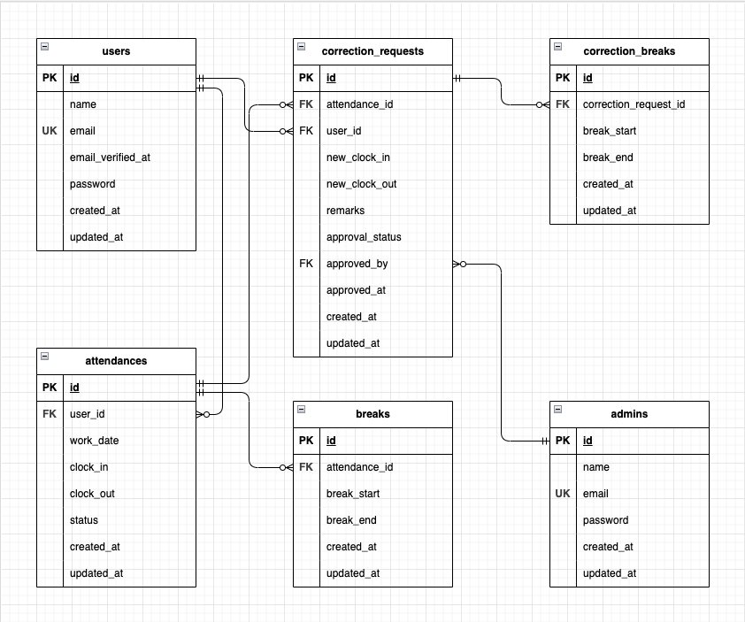

# coachtech勤怠管理アプリ

## 環境構築
**Dockerビルド**
1. git clone https://github.com/m-sato310/makio-mogi2.git

2. DockerDesktopアプリを立ち上げる

3. `docker-compose up -d --build`

> *MacのM1・M2チップのPCの場合、`no matching manifest for linux/arm64/v8 in the manifest list entries`のメッセージが表示されビルドができないことがあります。
エラーが発生する場合は、docker-compose.ymlファイルの「mysql」内に「platform」の項目を追加で記載してください*
``` bash
mysql:
    platform: linux/x86_64(この文追加)
    image: mysql:8.0.26
    environment:
```

**Laravel環境構築**
1. `docker-compose exec php bash`

2. `composer install`

3. 「.env.example」ファイルを 「.env」ファイルに命名を変更。または、新しく.envファイルを作成

4. .envに以下の環境変数を追加
``` text
DB_CONNECTION=mysql
DB_HOST=mysql
DB_PORT=3306
DB_DATABASE=laravel_db
DB_USERNAME=laravel_user
DB_PASSWORD=laravel_pass
```

5. アプリケーションキーの作成
``` bash
php artisan key:generate
```

6. マイグレーションの実行
``` bash
php artisan migrate
```

7. シーディングの実行
``` bash
php artisan db:seed
```

## メール認証機能(新規ユーザー登録時)
使用サービス:Mailtrap https://mailtrap.io/

### メール送信設定
1. Mailtrapのアカウントにログイン後、ダッシュボードからUsernameとPasswordを確認

2. 以下の設定を .env に記載
``` text
MAIL_MAILER=smtp
MAIL_HOST=sandbox.smtp.mailtrap.io
MAIL_PORT=2525
MAIL_USERNAME=（Mailtrapのダッシュボードで確認）
MAIL_PASSWORD=（同上）
MAIL_ENCRYPTION=tls
MAIL_FROM_ADDRESS=coachtech@example.com
MAIL_FROM_NAME="coachtech勤怠管理"
```

3. 設定後にPHPコンテナ内で下記コマンドを実行
``` bash
php artisan config:clear
```
※メール認証誘導画面の「認証はこちらから」押下でMailtrapのトップページに遷移します。ログイン後にinboxからメールを確認してください。

## 初期テストユーザー

| 名前            | メールアドレス           | 備考           |
|-----------------|--------------------------|----------------|
| 佐藤太郎        | taro@example.com         |                |
| 佐々木花子      | hanako@example.com       |                |
| 高橋健一        | kenichi@example.com      |                |
| 田中美咲        | misaki@example.com       |                |
| 山本勝太郎      | shotaro@example.com      |                |
| 管理者ユーザー   | admin@example.com        | 管理者ユーザー |

※全ユーザーのパスワードは共通で「testpass」です。

## テスト実行手順
1. MySQLコンテナにアクセス
``` bash
docker-compose exec mysql bash
```

2. rootユーザーでログイン(パスワードには’root’と入力)
``` bash
mysql -u root -p
```

3. テスト用データベースを作成(実行後ログアウトし、MySQLコンテナからも出る)
``` bash
CREATE DATABASE test_db;
SHOW DATABASES;
```

4. テスト用のテーブルを作成
``` bash
docker-compose exec php bash
php artisan config:clear
php artisan migrate --env=testing
```

5. テストを実行
``` bash
php artisan test tests/Feature
```

## 使用技術(実行環境)
- PHP8.3.0
- Laravel8.83.27
- MySQL8.0.29

## ER図


## URL
- 開発環境：http://localhost/
- phpMyAdmin:：http://localhost:8080/